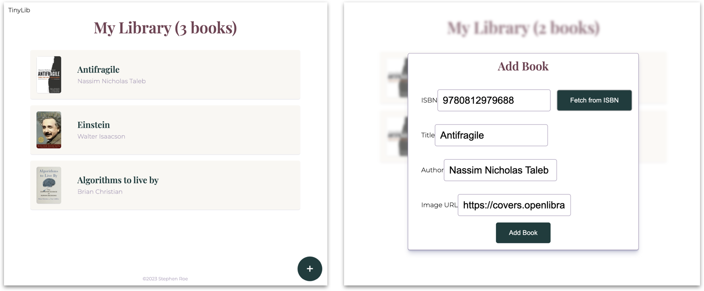

# Tinylib

**Sort all books in a small personal library**

I'm building this app to solve my book organization problem. I own a few hundred books, and sorting them manually is a hassle—but it's not a big enough library to warrant a professional library database solution.

- **Built with:** React, HTML5, CSS3, Webpack
- **License:** MIT

## Existing Features

### Manage a library in the browser

The app stores book data on the local browser using the LocalStorage API.

### Add a book by ISBN

Enter an ISBN and the app will auto-fill book data pulled from the [OpenLibrary API](https://openlibrary.org/developers/api).

### ISBN validation

The app validates ISBNs on the client side before sending an API request. It does this by analyzing requirements for 10- and 13-digit numbers, like valid characters and check digits, according to [the ISBN specification](https://en.wikipedia.org/wiki/ISBN#Check_digits).

### Manually add a book

It's a lot faster to automatically add a book, but no database is perfect. You can manually add any title that's not in the OpenLibrary database.

## Upcoming Features

The app is a work in progress. Here are the features I'm building out right now:

* **Refactoring to React.** I build the original prototype in vanilla JS and am refactoring it to React. I'm adding React Router and implementing test-driven development with React Testing Library.

* **Sorting.** The whole point I started this project! I'll be pulling in a variety of additional data from OpenLibrary, including Dewey Decimal Classification numbers, fiction/non-fiction, and general topic. I'll add nested sorting options for custom sort (e.g., fiction by author last name; non-fiction by DDC to two digits then by title).

* **User authentication.** Users should be able to create an account and store their own personal library.

* **Add backend database.** I'll be replacing the LocalStorage solution with a full database built with MongoDB, Express, and Node.js. It'll include user authentication and associated libraries.

* **Edit page.** Each book has an "edit" button, but it doesn't lead anywhere. I need to add a frontend interface for the existing update functions.

* **Fix known bugs and issues.** See below.

## Known Issues

These are known problems with the current version:

- [ ] Titles returned through the OpenLibrary API have inconsistent capitalization
- [ ] The footer appears on top of the last book when titles are longer than initial screen height
- [x] Currently there's no user warning if OpenLibrary doesn't match a valid ISBN
